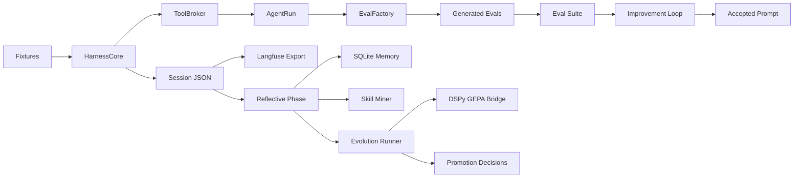

# Email Calendar Agent Lab Architecture

## Purpose

This project is a small autonomous reliability lab for an email/calendar agent. It uses mocked Gmail and Calendar tools, Langfuse-backed traces, JSON mirrors, SQLite memory, generated evals, skill mining, and deterministic prompt/harness evolution.

The system is designed around two connected loops:

1. **Eval Creation Loop**: production-like runs create failures, failures become reflection records, and reflection records become candidate evals.
2. **Self-Improvement Loop**: candidate prompt/harness changes are tested against generated, stable, and heldout evals; only safe improvements are accepted.

## Directory Layout

```text
email-calendar-agent-lab/
├── ARCHITECTURE.md
├── HERMES_REFLECTIVE_LOOP_PLAN.md
├── LANGFUSE.md
├── README.md
├── pyproject.toml
├── .env.langfuse.example
├── evals/
│   ├── generated.jsonl
│   ├── heldout.jsonl
│   ├── stable.jsonl
│   └── workflow.jsonl
├── logs/
│   ├── run_latest.json
│   └── sessions/
│       └── <scenario-session-id>.json
├── memory/
│   └── email_calendar_lab.sqlite
├── prompts/
│   ├── baseline.md
│   ├── candidate.md
│   ├── current.md
│   └── rejected_candidate.md
├── scripts/
│   ├── run_with_langfuse.sh
│   └── start_langfuse_local.sh
├── skills/
│   ├── ambiguous_contact_resolution.md
│   ├── flight_email_parsing.md
│   ├── free_busy_lookup.md
│   └── temporal_calendar_reasoning.md
└── src/email_calendar_lab/
    ├── agent.py
    ├── calendar_agent.py
    ├── email_agent.py
    ├── evals.py
    ├── evolution.py
    ├── fixtures.py
    ├── harness.py
    ├── langfuse_exporter.py
    ├── memory.py
    ├── memory_reflector_agent.py
    ├── models.py
    ├── orchestrator.py
    ├── providers.py
    ├── reflection.py
    ├── run_cycle.py
    ├── safety.py
    ├── session_store.py
    ├── skills.py
    ├── subagents.py
    ├── tool_broker.py
    ├── tools.py
    ├── validate_evals.py
    ├── workflow_agent.py
    └── workflow_evals.py
```

## Runtime Entry Points

### Default Eval Run

```bash
/usr/bin/env PYTHONPATH=src python3 -m email_calendar_lab.run_cycle
```

This is the primary system entry point. It runs the full lab:

- production failure discovery,
- generated eval creation,
- stable/generated/heldout eval scoring,
- rejected candidate check,
- accepted candidate check,
- workflow evals for dry-run email/calendar plans,
- session trace persistence,
- Langfuse export,
- reflective phase,
- SQLite memory writes,
- candidate skill mining,
- deterministic evolution decisions.

### Eval Artifact Validation

```bash
/usr/bin/env PYTHONPATH=src python3 -m email_calendar_lab.validate_evals
```

Validates JSONL eval files under `evals/`.

### Local Langfuse

```bash
bash scripts/start_langfuse_local.sh
```

Starts a local Langfuse instance via the official Docker Compose setup. Runtime keys are stored in `.env.langfuse.local`, which is intentionally not committed.

## Core Source Modules

### `models.py`

Defines shared dataclasses:

- `Contact`
- `CalendarEvent`
- `EmailAttachment`
- `Email`
- `ToolCall`
- `Scenario`
- `AgentRun`
- `EvalCase`
- `DraftEmail`
- `CalendarMutation`
- `SafetyDecision`
- `AuditEvent`
- `WorkflowPlan`

These models are intentionally simple and serializable. They are the contract between tools, harness, evals, logs, reflections, and memory.

The action models are dry-run by default. Proposed email sends, calendar creates, cancellations, and reschedules require confirmation and are mirrored into audit events before they can be treated as executable.

### `fixtures.py`

Contains all synthetic data:

- contacts,
- calendar events,
- recurring events,
- emails,
- production scenarios,
- stable evals,
- heldout evals,
- workflow evals.

This file is the mocked production world. No real Gmail or Calendar account is used.

### Specialist Agents

The first expansion slice adds deterministic local agents that sit beside the original harness:

- `email_agent.py`: priority inbox scoring, thread summaries, attachment date extraction, and sentiment escalation drafts.
- `calendar_agent.py`: multi-calendar availability, smart slots, recurrence conflict detection, and mutation proposals.
- `workflow_agent.py`: end-to-end dry-run plans for priority inbox, meeting requests, cancellations, and weekly review.
- `orchestrator.py`: routes natural-language workflow requests to the specialist agents.
- `memory_reflector_agent.py`: converts workflow results into lightweight reflection records for eval/skill mining.
- `safety.py`: central confirmation gate and audit event recorder.

All workflow side effects are represented as `WorkflowPlan` objects. The mocked system can propose drafts and calendar mutations, but it does not send email or mutate calendars unless the safety gate is explicitly switched to confirmed mode.

### `tools.py`

Implements mocked Gmail and Calendar-style tools:

- `GmailTools.search_emails`
- `CalendarTools.search_events`
- `CalendarTools.free_busy`
- contact helpers.

Each tool records `ToolCall` objects with arguments, result counts, and evidence IDs.

### `tool_broker.py`

Wraps tools behind a broker. This is the opencode-style tool mediation layer.

Responsibilities:

- expose tool schemas,
- own the `ToolRecorder`,
- provide Gmail/Calendar tool instances,
- produce normalized tool traces for sessions and Langfuse.

### `providers.py`

Defines the provider-agnostic model boundary.

Current implementation:

- `ModelProvider` protocol,
- `DeterministicProvider`,
- `PromptBundle`.

The project does not call a real model. The provider stores model metadata and prompt/rule/skill context so the harness shape matches a real agent system.

### `agent.py`

Contains the deterministic email/calendar domain policy.

Important pieces:

- `AgentConfig`
- `BASELINE_CONFIG`
- `DeterministicEmailCalendarPolicy`
- `EmailCalendarAgent` compatibility facade
- `score_answer`

This module is deliberately deterministic so eval and improvement behavior is reproducible.

### `harness.py`

The core session runner.

Responsibilities:

- create build/plan sessions,
- load relevant skills,
- create prompt bundles,
- run the deterministic policy,
- collect tool calls,
- score the answer,
- produce `HarnessResult`.

Key types:

- `AgentMode`
- `Session`
- `SessionStep`
- `ToolRequest`
- `HarnessResult`
- `HarnessCore`

### `session_store.py`

Persists full per-scenario harness sessions to:

```text
logs/sessions/*.json
```

These JSON session files are the local mirror of Langfuse traces.

### `langfuse_exporter.py`

Exports harness sessions and reflective-phase records to Langfuse.

Langfuse is the default eval trace backend. If credentials are missing, the run continues and records the skipped export reason in `logs/run_latest.json`.

Local env file:

```text
.env.langfuse.local
```

Expected env vars:

- `LANGFUSE_HOST`
- `LANGFUSE_PUBLIC_KEY`
- `LANGFUSE_SECRET_KEY`
- `LANGFUSE_TRACING_ENABLED`

### `evals.py`

Runs suites and manages eval artifacts.

Responsibilities:

- execute scenarios through the harness,
- score runs by category,
- convert failures into candidate evals,
- convert eval cases back into scenarios,
- read/write/validate JSONL files.

### `subagents.py`

Local subagent-style components:

- `TraceEvaluator`: summarizes traces into root-cause decisions.
- `EvalFactory`: turns failures into deduped candidate evals.
- `ImprovementProposer`: proposes prompt rules from root causes.

These are lightweight local classes rather than external agents.

### `reflection.py`

Implements the Hermes-inspired reflective phase.

`ReflectivePhase` turns every `HarnessResult` into a `ReflectionRecord`.

Reflection records include:

- lesson type,
- root cause,
- whether the lesson generalizes,
- recommended artifact,
- confidence,
- evidence IDs,
- Langfuse export status.

Lesson types include:

- `bad_temporal_reasoning`
- `bad_tool_args`
- `missing_evidence`
- `ambiguous_contact`
- `timezone_loss`
- `useful_success`
- `unknown_failure`

### `memory.py`

Local SQLite persistent memory.

Database:

```text
memory/email_calendar_lab.sqlite
```

Tables:

- `sessions`
- `reflections`
- `lessons`
- `user_preferences`
- `artifact_promotions`
- optional `memory_fts` FTS5 table

This is the long-term searchable archive of sessions, reflections, lessons, and promotion decisions.

### `skills.py`

Loads and mines skills.

Responsibilities:

- load Markdown skills from `skills/`,
- match skills to scenario category/query,
- inject skill summaries into prompt bundles,
- mine useful successes into quarantined candidate skills.

### `dspy_gepa.py`

Default DSPy/GEPA backend bridge for reflective prompt evolution.

Responsibilities:

- prepare GEPA-ready text artifacts,
- convert reflections into Actionable Side Information,
- expose a `dspy.GEPA` integration status block,
- keep deterministic local fallback when reflection LM config is missing or the backend is explicitly disabled.

Install backend dependencies with:

```bash
python3 -m pip install -e .
```

The backend is enabled by default. Configure a reflection LM with:

```bash
DSPY_GEPA_REFLECTION_LM=openai/gpt-5
```

Disable with:

```bash
DSPY_GEPA_ENABLED=false
```

### `evolution.py`

Deterministic GEPA-like self-evolution runner with the default DSPy/GEPA backend bridge.

Responsibilities:

- propose prompt-rule variants from reflections,
- prepare DSPy/GEPA artifacts for prompt rules, skill text, and tool descriptions,
- include Actionable Side Information from traces and reflection records,
- promote safe generated evals,
- quarantine candidate skills,
- reject bad/no-op variants,
- summarize decisions in `logs/run_latest.json`.

### `improvement.py`

Compatibility wrapper around the improvement proposer and acceptance gate.

Responsibilities:

- propose the accepted candidate prompt rules,
- create the intentionally rejected candidate,
- enforce improvement/no-regression acceptance.

### `run_cycle.py`

The orchestrator.

Runs the full reliability lab:

1. Baseline production scenarios.
2. Failure-derived generated evals.
3. Stable/generated eval suite.
4. Heldout eval suite.
5. Bad candidate rejection.
6. Candidate improvement run.
7. Prompt/current artifact writing.
8. Session JSON persistence.
9. Langfuse export.
10. Reflective phase.
11. SQLite memory persistence.
12. Candidate skill mining.
13. Evolution decisions.
14. `logs/run_latest.json` summary.

### `validate_evals.py`

CLI module for validating eval JSONL artifacts.

## Data Flow



## Eval Sets

### `evals/stable.jsonl`

Promoted regression tests. These represent durable behavior the agent should not break.

### `evals/generated.jsonl`

Candidate evals derived from production-like failures and enriched by reflection metadata:

- `reflection_id`
- `lesson_type`
- `promotion_status`
- `first_seen_at`
- `seen_count`

### `evals/heldout.jsonl`

Anti-overfitting checks. Candidate changes must not regress this set overall or by category.

## Logs And Memory

### `logs/run_latest.json`

Top-level run report. Includes:

- default eval backend,
- production failure discovery,
- eval validation,
- session logs,
- Langfuse export status,
- reflective phase records,
- memory summary,
- candidate skills,
- candidate eval promotions,
- evolution decisions,
- rejected candidate,
- accepted candidate,
- before/after runs,
- heldout runs.

### `logs/sessions/*.json`

Per-scenario harness trace. Includes:

- provider metadata,
- model metadata,
- prompt bundle,
- loaded skill IDs,
- tool calls,
- final answer,
- eval decision.

### `memory/email_calendar_lab.sqlite`

Persistent archive. Used for long-term compounding behavior.

## Skill System

Committed skills:

- `skills/temporal_calendar_reasoning.md`
- `skills/flight_email_parsing.md`
- `skills/ambiguous_contact_resolution.md`
- `skills/free_busy_lookup.md`

Skill lifecycle:

1. Static skill docs are matched by category/query.
2. Loaded skill IDs are recorded in session traces.
3. Useful successes are mined into candidate skills.
4. Candidate skills stay quarantined until validation.
5. Future evolution can promote or rewrite skills.

## Langfuse Role

Langfuse is the default eval trace backend.

Each harness session becomes a trace with:

- root span,
- deterministic policy generation,
- tool spans,
- eval span.

The reflective phase can also export a post-run reflection trace.

If Langfuse keys are missing, the run still works. JSON logs and SQLite memory are the local mirror.

## Acceptance And Anti-Overfitting

Candidate prompt/harness changes are accepted only if:

- generated + stable eval score improves,
- heldout score does not regress,
- heldout category scores do not regress.

Generated evals and candidate skills start quarantined. Promotion decisions are recorded separately from raw generation.

## DSPy And GEPA

The project includes a DSPy/GEPA bridge for reflective optimization. It follows the GEPA pattern:

1. Convert traces and reflections into Actionable Side Information.
2. Prepare text artifacts such as prompt rules, skill text, and tool descriptions.
3. Use deterministic gates locally.
4. Hand the artifacts to the DSPy/GEPA backend when a reflection LM is configured.

By default, the bridge prepares artifacts and records whether full DSPy/GEPA compile was available. This keeps local runs reproducible while making the GEPA backend explicit.

## Current Non-Goals

- No real Gmail/Calendar account integration.
- No model fine-tuning.
- No remote service required for local correctness.
- No fully automatic skill promotion without validation.

