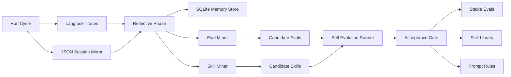

# Hermes-Inspired Reflective Loop Plan

## Goal

Evolve the email/calendar reliability lab from a single improvement cycle into a compounding learning system: every run produces traces, traces produce reflections, reflections produce evals/skills/prompt variants, and only validated improvements are promoted.

This plan adapts the Hermes ideas without changing model weights. Improvements stay portable: prompts, harness rules, skill docs, tool descriptions, evals, and configs.

## Concepts To Borrow

- **Reflective phase after execution**: analyze each complex run after the answer/eval cycle.
- **Experience mining**: convert failures, recoveries, and surprising successes into structured records.
- **Skill distillation**: write reusable Markdown procedures for repeated successful patterns.
- **Persistent memory**: keep searchable session summaries, root causes, useful failures, and user preferences.
- **Self-evolution pipeline**: propose prompt/harness/skill variants, test them on evals, and accept only Pareto-better candidates.
- **Pruning and promotion**: quarantine new memories/evals/skills before promotion; remove low-value artifacts.

## Target Architecture



## Implementation Plan

1. Add a reflective phase module.
   - Create `src/email_calendar_lab/reflection.py`.
   - Input: `HarnessResult`, session JSON, Langfuse export status, and eval outcome.
   - Output: `ReflectionRecord` with `lesson_type`, `root_cause`, `generalizes`, `recommended_artifact`, and `confidence`.
   - Classify failures such as bad temporal reasoning, bad tool args, missing evidence, ambiguous contacts, and timezone loss.
   - Also classify useful successes, especially recovered paths after prompt/harness changes.

2. Add persistent memory.
   - Create `src/email_calendar_lab/memory.py`.
   - Use SQLite from the standard library.
   - Tables: `sessions`, `reflections`, `lessons`, `user_preferences`, `artifact_promotions`.
   - Add FTS5 if available for searching session summaries and lessons.
   - Keep memory local under `memory/email_calendar_lab.sqlite`.

3. Add eval mining from reflections.
   - Extend the current `EvalFactory` in `src/email_calendar_lab/subagents.py`.
   - Convert only generalizable failures into candidate evals.
   - Add metadata: `reflection_id`, `lesson_type`, `promotion_status`, `first_seen_at`, `seen_count`.
   - Deduplicate by normalized query, category, expected evidence, and failure signature.

4. Add skill mining.
   - Create `skills/` with Markdown skill docs.
   - Create `src/email_calendar_lab/skills.py`.
   - Distill reusable patterns into skill documents, for example:
     - `skills/temporal_calendar_reasoning.md`
     - `skills/flight_email_parsing.md`
     - `skills/ambiguous_contact_resolution.md`
     - `skills/free_busy_lookup.md`
   - Each skill should include trigger, procedure, required tools, evidence checks, and failure modes.

5. Add skill loading in the harness.
   - Extend `providers.py` or `harness.py` so prompt bundles include relevant skill summaries.
   - Match skills by scenario category and query keywords.
   - Record loaded skill IDs in session traces and Langfuse metadata.

6. Add a self-evolution runner.
   - Create `src/email_calendar_lab/evolution.py`.
   - Generate candidate variants of:
     - prompt rules,
     - skill text,
     - tool descriptions,
     - scorer requirements.
   - Keep this deterministic at first: generate a small set of variants from reflection categories.
   - Later, this could be swapped for GEPA/DSPy-style optimization.

7. Strengthen acceptance gates.
   - Require improvements on candidate + stable evals.
   - Require no overall heldout regression.
   - Require no per-category heldout regression.
   - Require skill variants to pass the evals associated with their trigger category.
   - Reject artifacts that improve one case but fail related skills/evals.

8. Add pruning and promotion.
   - Candidate evals/skills start quarantined.
   - Promote after repeated observation or passing validation.
   - Prune low-value memories and duplicate reflections.
   - Keep high-value failures permanently when they reveal edge cases.

9. Wire into `run_cycle.py`.
   - After the current eval/improvement loop, run the reflective phase.
   - Persist reflections to SQLite.
   - Mine candidate evals and skills.
   - Run self-evolution candidates.
   - Write a new summary block in `logs/run_latest.json`:
     - `reflective_phase`,
     - `memory`,
     - `candidate_skills`,
     - `candidate_eval_promotions`,
     - `evolution_decisions`.

10. Surface in Langfuse.
    - Add reflection spans below each harness trace or a post-run trace named `reflective-phase`.
    - Include lesson type, artifact proposal, promotion decision, and linked eval IDs.
    - Keep JSON session logs as the local mirror.

## Initial Skill Document Template

```markdown
# Skill: <name>

## Trigger
When the user asks...

## Procedure
1. Resolve ambiguity.
2. Query tools with exact time/evidence constraints.
3. Exclude invalid evidence.
4. Answer with cited facts only.

## Required Evidence
- Tool:
- Evidence IDs:
- Forbidden evidence:

## Common Failures
- ...

## Validation Evals
- ...
```

## Success Criteria

- `python3 -m email_calendar_lab.run_cycle` still works.
- Langfuse remains the default eval trace backend.
- SQLite memory is created locally and searchable.
- Each run produces reflection records.
- At least one failure becomes a candidate eval through reflection.
- At least one success/recovery becomes a candidate skill.
- Acceptance gates can reject a bad prompt or skill variant.
- `logs/run_latest.json` shows reflection, memory, skill, and evolution summaries.

## Non-Goals

- No real Gmail/Calendar integration.
- No model fine-tuning.
- No dependency on remote Langfuse for local correctness.
- No fully automatic promotion of skills without validation.

