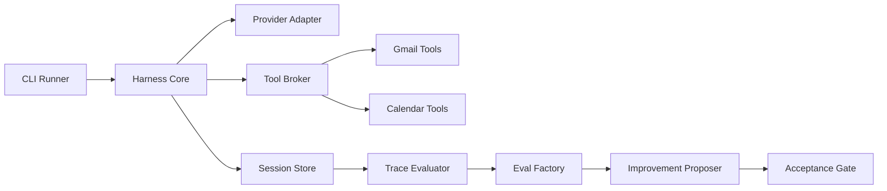

# Self-Improving Email + Calendar Agent

Small autonomous reliability lab for a mocked Gmail/Calendar agent. It discovers failures, converts them into candidate evals, proposes prompt/harness rules from root-cause categories, and accepts a change only when it improves eval coverage without held-out regressions.

The harness borrows architecture ideas from OpenCode-style agents: plan/build modes, provider-agnostic model metadata, a tool broker, session traces, and subagent-like evaluators. This project is not affiliated with OpenCode.

## Plan

1. Build a weak baseline agent using mocked Gmail and Calendar tools over synthetic data.
2. Run production-like scenarios for next meetings, last syncs, flights, free/busy, ambiguity, and temporal anchors.
3. Convert observed failures into deduped candidate JSONL eval cases.
4. Propose prompt/harness rules from classified root causes.
5. Re-run stable plus generated evals and a held-out set.
6. Reject no-op or regressing candidates; accept only net improvements with no held-out category regression.
7. Write the accepted config to `prompts/current.json` and load it as the baseline for the next cycle.

## Run

```bash
cd /Users/okay/Documents/email-calendar-agent-lab
/usr/bin/env PYTHONPATH=src python3 -m email_calendar_lab.run_cycle
```

This default eval uses Langfuse as the primary trace/eval backend and writes JSONL/session artifacts as a local mirror. If Langfuse keys are not configured yet, the run still completes and reports why export was skipped.

Validate local JSON mirror artifacts only:

```bash
/usr/bin/env PYTHONPATH=src python3 -m email_calendar_lab.validate_evals
```

Run with local Langfuse tracing:

```bash
bash scripts/start_langfuse_local.sh
cp .env.langfuse.example .env.langfuse.local
python3 -m pip install -e .
# fill .env.langfuse.local with keys from http://localhost:3000
/usr/bin/env PYTHONPATH=src python3 -m email_calendar_lab.run_cycle
```

Langfuse is the default eval backend. If `.env.langfuse.local` or exported Langfuse keys are present, the default run exports traces. Set `LANGFUSE_TRACING_ENABLED=false` to disable export and use only the JSON mirror. See `LANGFUSE.md` for the full local setup and key configuration flow.

Outputs:

- `logs/run_latest.json`: tool calls, answers, failures, generated evals, before/after scores, decision.
- `evals/generated.jsonl`: carried-forward candidate evals derived from observed production-like failures.
- `evals/workflow.jsonl`: deterministic workflow eval contracts for dry-run assistant plans.
- `evals/stable.jsonl`: promoted regression evals.
- `evals/heldout.jsonl`: anti-overfitting checks.
- `prompts/current.md`: accepted prompt/harness rules.
- `prompts/current.json`: machine-readable accepted config loaded on the next iteration.
- `prompts/rejected_candidate.md`: rejected no-op candidate used to prove the gate.
- `logs/sessions/*.json`: per-scenario harness sessions with provider, prompt, tool, answer, and eval steps.
- Langfuse traces: one trace per harness session by default when local Langfuse keys are configured.

## Architecture

- `fixtures.py`: synthetic Gmail, Calendar, contacts, production scenarios, stable evals, held-out evals.
- `providers.py`: provider-neutral prompt bundle interface with a deterministic local provider.
- `tool_broker.py`: opencode-style tool mediation for Gmail/Calendar schemas, calls, and evidence traces.
- `harness.py`: core plan/build session runner, separated from CLI/eval orchestration.
- `session_store.py`: persists full per-run sessions under `logs/sessions`.
- `reflection.py`: post-run reflective phase that classifies failures and useful successes.
- `memory.py`: local SQLite memory for sessions, reflections, lessons, and artifact promotions.
- `skills.py`: skill library, skill matching, and candidate skill mining.
- `dspy_gepa.py`: optional DSPy/GEPA bridge that prepares prompt/skill/tool artifacts and Actionable Side Information.
- `email_agent.py`, `calendar_agent.py`, `workflow_agent.py`, `orchestrator.py`: local specialist agents for priority inbox, scheduling intelligence, and dry-run workflows.
- `safety.py`: confirmation gate and audit log for proposed email/calendar side effects.
- `workflow_evals.py`: deterministic workflow evals and safety metrics.
- `evolution.py`: deterministic GEPA-like self-evolution runner, DSPy/GEPA bridge status, and promotion decisions.
- `subagents.py`: local trace evaluator, eval factory, and improvement proposer.
- `tools.py`: mocked Gmail search, Calendar search, free/busy, and evidence IDs.
- `agent.py`: deterministic email/calendar domain policy. `AgentConfig.model` defaults to `gpt-5.4-mini`, but provider metadata is owned by the harness.
- `evals.py`: suite execution through the harness, evidence-aware scoring, JSONL validation, deduping, and failure-to-eval conversion.
- `improvement.py`: compatibility wrapper around the subagent-style improvement proposer plus acceptance/rejection gates.
- `run_cycle.py`: one complete eval creation plus self-improvement cycle; loads the prior accepted config before scoring.

## Harness Shape



## Current Evidence

Latest run:

```text
default eval backend: langfuse
production discovery: 1/7 passed
generated evals: 6
workflow evals: 3/3 passed
eval validation: {'stable.jsonl': 3, 'generated.jsonl': 6, 'heldout.jsonl': 3, 'workflow.jsonl': 3}
session logs: 43
langfuse export: {'backend': 'langfuse', 'default_eval_backend': True, ...}
reflections: 43
memory: /Users/okay/Documents/email-calendar-agent-lab/memory/email_calendar_lab.sqlite
candidate skills: 13
rejected candidate: rejected: did not improve generated+stable eval score
before eval score: 0.0
after eval score: 1.0
heldout before/after: 0.667 -> 1.0
accepted: improved generated+stable eval score without heldout regression
```

The generated evals cover cancelled events, attendees vs senders, flight destination parsing, source time zones, ambiguous Alex contacts, and “last before offsite” temporal reasoning. Stable and held-out evals separately cover promoted regressions, recurring meetings, source time zones, and Sarah/Sara-style contact ambiguity.

The workflow slice adds richer email/calendar models and three dry-run workflows: priority inbox summary, meeting request to proposed invite, and cancellation to proposed calendar update plus notification draft. Workflow evals assert expected evidence, proposed action types, audit events, and zero unauthorized side effects.

## Reflective Loop

After the normal eval/improvement cycle, the lab runs a Hermes-inspired reflective phase:

- Every harness session is classified into a `ReflectionRecord`.
- Generalizable failures are linked back into generated eval metadata with `reflection_id`, `lesson_type`, and quarantine status.
- Useful successes are mined into candidate skills.
- Sessions, reflections, lessons, and promotion decisions are persisted in `memory/email_calendar_lab.sqlite`.
- `evolution.py` proposes deterministic prompt/skill/eval decisions and keeps unsafe artifacts quarantined or rejected.
- Langfuse remains the default eval trace backend; JSON, SQLite, and session files are local mirrors.

## DSPy And GEPA

The loop prepares DSPy/GEPA-ready artifacts from reflection records:

- prompt rules,
- skill text,
- tool descriptions.

It also emits Actionable Side Information from failures, evidence IDs, eval feedback, and anti-overfitting constraints. The DSPy/GEPA backend is enabled by default; deterministic GEPA-lite remains the local fallback if a reflection LM is not configured.

```bash
python3 -m pip install -e .
DSPY_GEPA_REFLECTION_LM=openai/gpt-5 \
  /usr/bin/env PYTHONPATH=src python3 -m email_calendar_lab.run_cycle
```

To disable the backend explicitly, set `DSPY_GEPA_ENABLED=false`.

The run summary records `evolution_decisions.dspy_gepa` with artifacts, ASI, and bridge status.

## Scoring Contract

Each eval can check:

- Required answer snippets.
- Forbidden answer snippets.
- Required tool names.
- Required evidence IDs returned by tools.
- Required tool arguments, such as `include_cancelled=false`.

This keeps the agent from passing by guessing a string while using the wrong evidence or tool arguments.

## Anti-Overfitting

Generated evals are not treated as truth forever by default. They start with `lifecycle="candidate"` in `generated.jsonl`, while promoted regressions live in `stable.jsonl`. New failure-derived evals are merged with carried-forward generated evals, so the next iteration keeps auto-evaluating prior failures even after the production scenario starts passing. Candidate changes are scored on stable plus generated evals, but acceptance also requires no overall or per-category regression on `heldout.jsonl`.

The loop also tries a deliberately bad evidence-skipping candidate and logs its rejection. In a larger version, generated evals should be promoted only after repeated failures, category deduping, and human or oracle validation.
